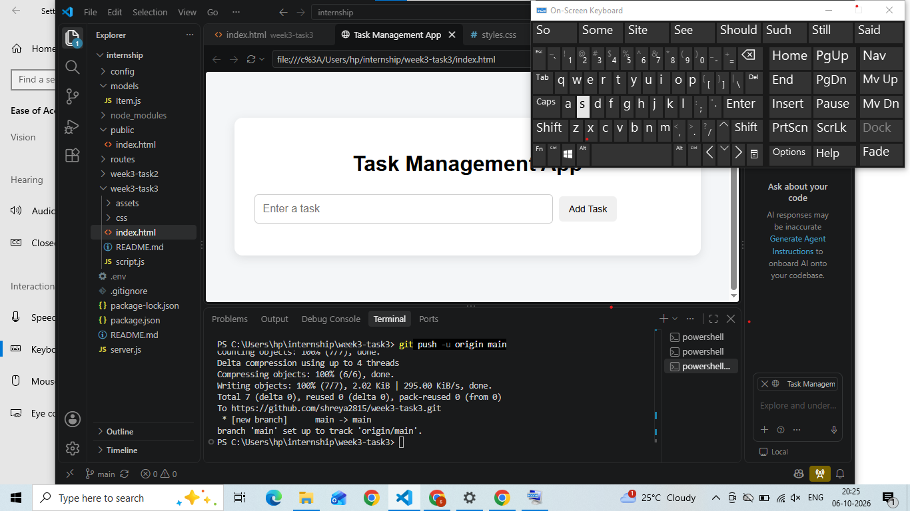

# Task Management App

## Project Overview

A simple and responsive Task Management Application built using HTML, CSS, and JavaScript.

## Features

- Add new tasks
- Edit tasks
- Mark tasks as completed
- Delete tasks
- Save tasks using LocalStorage
- Responsive design for mobile devices
- Simple and user-friendly interface

## Technologies Used

- HTML5
- CSS3
- JavaScript
- LocalStorage

## How to Run

1. Download or clone this project.
2. Open the project folder.
3. Open `index.html` in a web browser.
4. Start adding and managing tasks.

## Project Structure

```text
week3-task3/
│
├── index.html
├── script.js
├── css/
│   └── styles.css
├── assets/
│   └── screenshots/
│       └── task-management-app.png
└── README.md
```

## Screenshot

## Author

Shreya